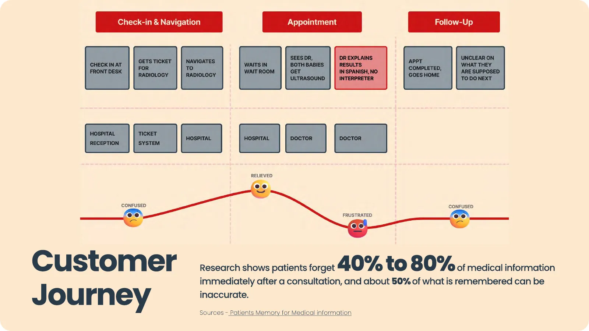
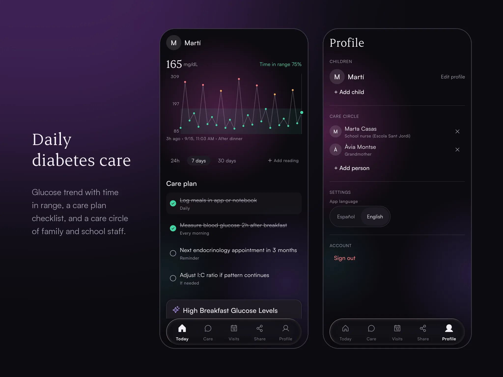
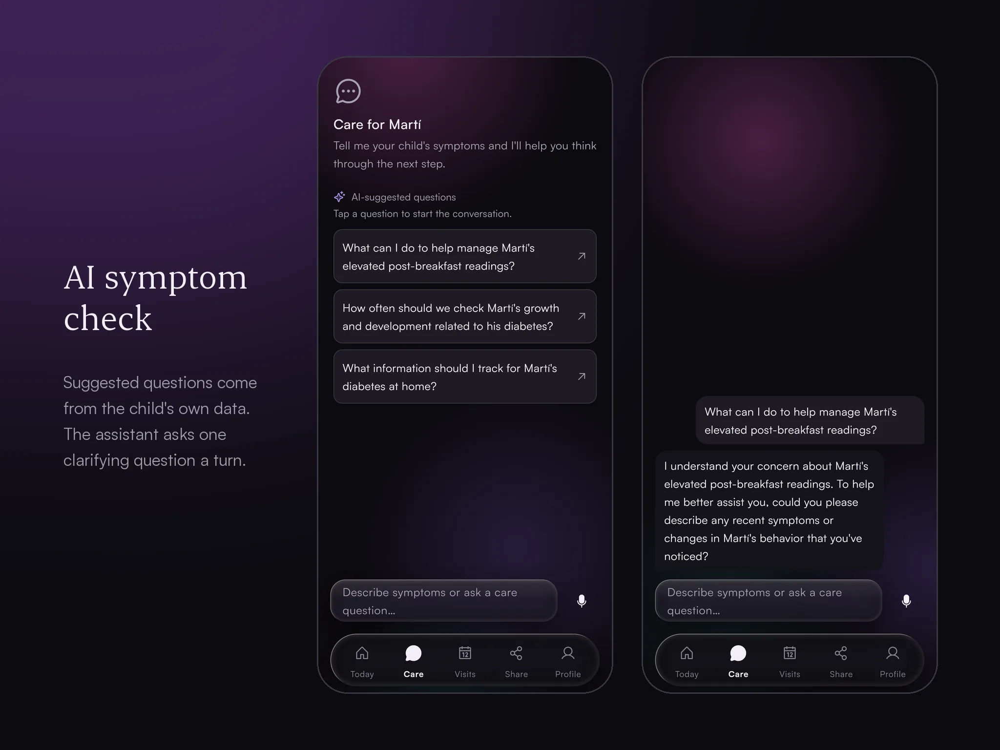
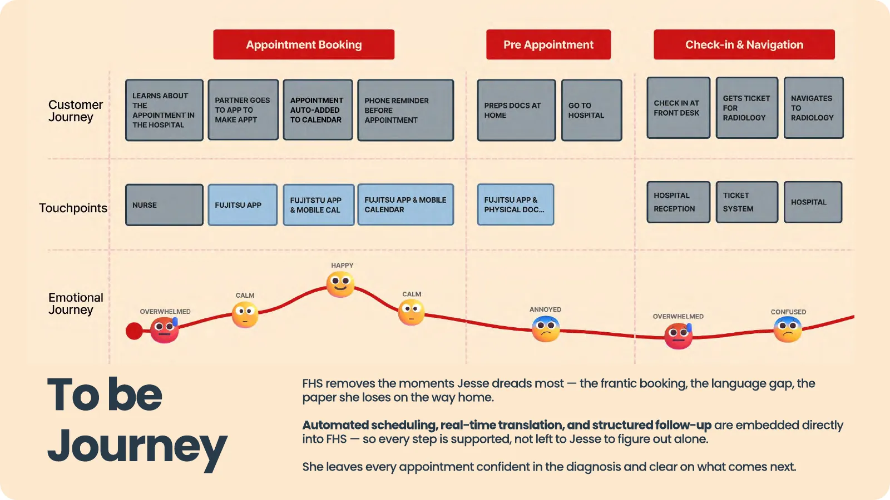
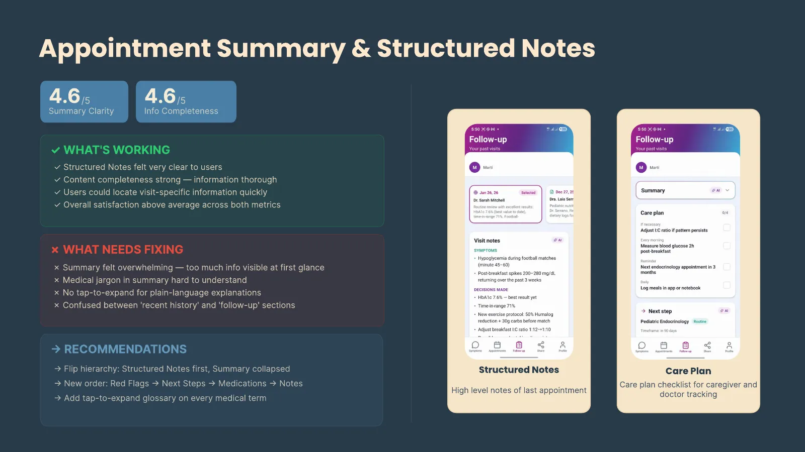
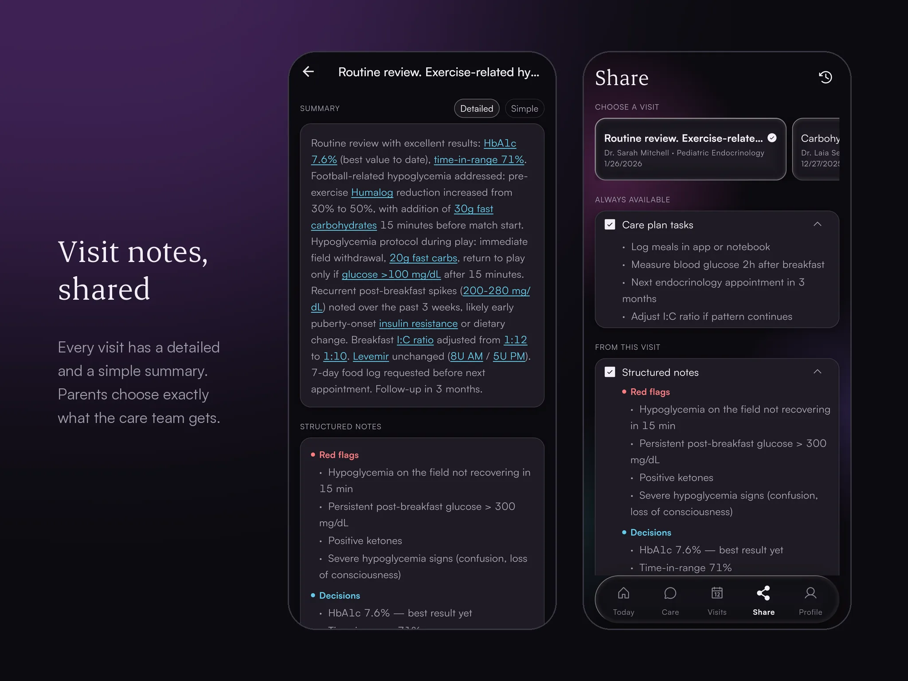
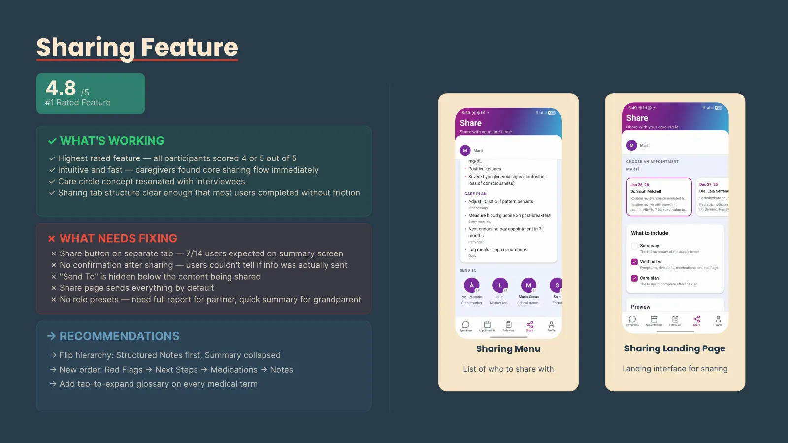
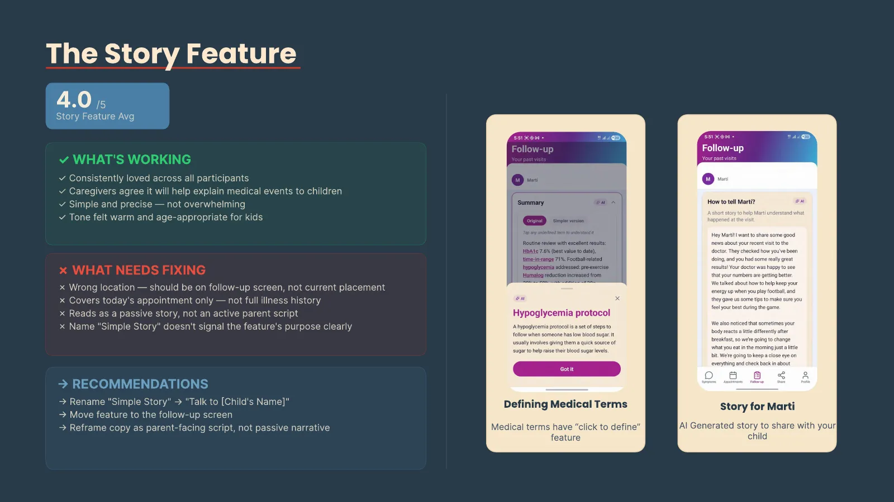

## Context
A brief from Fujitsu at IED Barcelona, working on FHS (Fujitsu Healthcare
Suite) for families managing chronic paediatric conditions.

Four of us, based in Barcelona, with access to local caregivers and pharmacies
for fieldwork.

### My role
I built the working prototype: the Flutter app, the TypeScript backend on
Supabase, and the GPT-4o-mini and Whisper integration behind the summaries and
the children's story. I ran the iteration cycles on it.

I also worked on data analysis, journey mapping, the framing that got us from
scattered findings to a single problem statement, and the UX design of the
flows.

I contributed to user testing and to the interface design without leading
either. Primary field research (recruitment, interviews, outreach) was mostly
run by my teammates. My work started with what came back from it.

## Problem
Caring for a medically complex child is not only hard on the child.

62% of those children are readmitted within 90 days of discharge, and 49% of
their caregivers report a very severe burden.

Two separate numbers describe the load, and they measure different things.
Scheduling and admin tasks alone take about 249 hours a year. Overall mental
load, which is the wider job of holding the whole thing in your head, runs at
roughly 32 hours a week.

## Research
The team ran six stages, from broad signals to a validated prototype: community
outreach with surveys and posters in local pharmacies; qualitative interviews;
data analysis and journey mapping; sacrificial concepts to test ideas early;
prototype and user testing with 14 participants across 5 flows; and a final
iteration pass.

My part sat on the analysis side and after it. Working through what the
interviews returned, mapping it, and building the prototype the last two stages
tested.

### What kept recurring
Caregivers spend 40%+ of their week managing care across a typical 11 to 15
visits a year.

Only 49% of appointment information is recalled afterwards. 80% of visits leave
medical terms unexplained, and 1 in 4 parents has low health literacy, rising to
1 in 3 in emergency settings.

67% of parents said they needed help coordinating care at all, and 15.8% forgo
medical care outright once coordination passes five hours a week.

### The two caregivers who anchored it
Jesse, 30, a graphic designer with two children under three, whose health
information was scattered across apps, chats, paper and calendars. Nothing in
one place.

Oscar, 35, a project manager raising a son with diabetes alone, who had no
guidance between appointments and treated every escalation as a solo decision
with no safety net. "The hardest part is not knowing if it's a bad day or an
emergency."

### Sources
Caregiver burden and admin hours: PubMed, National Profile of Caregiver
Challenges. Unexplained jargon: Surgeon Use of Medical Jargon with Parents in
the Outpatient Setting (PMC6525640). Coordination help and forgone care:
Inequities in Care Coordination. Recall after a consultation: Patients' Memory
for Medical Information.

## Insight
The barrier is not access to care. Access already exists. What is missing is
everything that happens *between* appointments: fragmented information, jargon
parents cannot act on, and children who do not understand what is happening to
them.

**Cognitive load is the core stressor.** Once we named it that way, it decided
every subsequent design decision. Not more features. Less to hold in your head.

## Solution
An AI-powered care assistant embedded inside FHS, built around one question:
what if every caregiver left each appointment with a clear plan and the
confidence to act on it?

This one runs. It is not a Figma prototype. It is a Flutter app with a
TypeScript backend on Supabase, with GPT-4o-mini generating the plain-language
summaries and Whisper handling voice input, deployed and testable.

Building it rather than mocking it changed what we could learn. The 14
participants used a working product, so their feedback was about whether the
summaries were actually understandable, not whether they could imagine them
being understandable.

### The live app is v2
Same three features, with a tidied information architecture and a reworked
interface. The screens in the test results below are from the version the 14
participants used, so the live app will not match them screen for screen.

### Appointment summaries and structured notes
A jargon-free record of every visit, structured so the whole care circle can
read and act on it. Aimed at the 49% recall gap.

### Sharing with the care circle
Custom profiles for the people around the child, so a partner and a grandparent
do not need the same level of detail. Aimed at the 67% who asked for
coordination help.

### Appointment management
Integration with a caregiver's own calendar, aimed at the hours lost to
scheduling and admin.

The story feature was not in the original brief. It came out of interviews,
where parents kept describing having to explain a diagnosis twice: once to
themselves, then again to their child.

## Outcome
Tested with 14 caregivers across 5 user flows: 7 in-person think-aloud sessions
in homes and cafés, 7 virtual run-throughs, and 2 expert reviews. Ages 24 to 62,
varying digital literacy.

Every feature scored 4.0 out of 5 or higher. Sharing was rated the single most
useful addition at 4.8, with all 14 participants scoring it 4 or 5. Summary
clarity came in at 4.6, and the children's story at 4.0.

Overall experience, averaged across clarity, completeness and trust, scored
3.8 out of 5. That number is lower than any individual feature, and it is the
honest one: people liked the parts and were less sure about the whole.

### What this does not yet prove
The demo validated usability and the feature concept. It did not measure time
saved or comprehension gained.

Those are the numbers that would actually justify the work, and they need
pre/post time-tracking and a comprehension quiz against a control. That is the
next study, not a claim we can make from this one.
